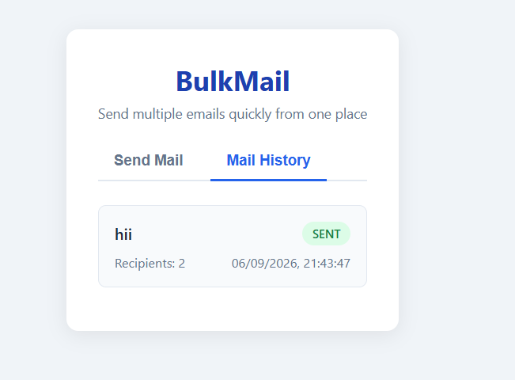
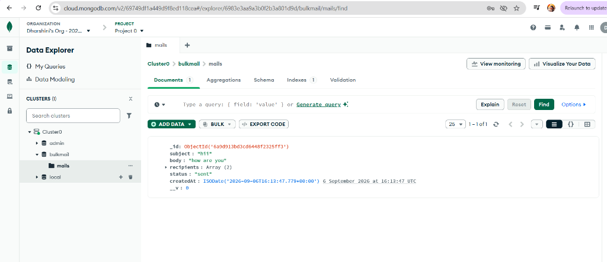

# Bulk Mail App 📧

A full-stack web application built for sending bulk emails efficiently. Users can upload recipient lists via CSV drag-and-drop or manual entry, compose email subject & body text, send emails in bulk via Gmail SMTP, and view email history stored in MongoDB Atlas.

---

## ✨ Features

- **CSV Drag & Drop Upload**: Upload `.csv` files directly in the browser. Automatically parses, validates email syntax, and removes duplicate addresses.
- **Manual Recipient Input**: Paste multiple email addresses line-by-line.
- **Dynamic Recipient Counter**: Combines CSV and manual emails, deduplicates them, and displays the valid total recipient count.
- **Bulk Email Sending**: Sends emails reliably using Node.js and Nodemailer with Gmail SMTP.
- **MongoDB Atlas Integration**: Automatically logs every email campaign with details (`subject`, `body`, `recipients`, `status`, and `createdAt`).
- **Mail History View**: Switch between **Send Mail** and **Mail History** tabs to review previous email logs (`SENT` / `FAILED`).
- **Responsive & Clean UI**: Simple, student-friendly blue interface designed for laptops and mobile devices.

---

## 🖼️ Application Screenshots & Database Logs

### Mail History & Sent Campaign View


### MongoDB Atlas Document Storage


---

## 🛠️ Tech Stack

- **Frontend**: React (Vite), Vanilla CSS
- **Backend**: Node.js, Express.js
- **Database**: MongoDB Atlas (Mongoose)
- **Email Service**: Nodemailer (Gmail SMTP)

---

## 📁 Project Structure

```
w-13/
├── backend/
│   ├── models/
│   │   └── Mail.js         # Mongoose schema for email logs
│   ├── .env.example        # Environment variables template
│   ├── .gitignore          # Backend ignored files
│   ├── index.js            # Express server & API endpoints
│   └── package.json
├── frontend/
│   ├── src/
│   │   ├── App.jsx         # React UI component & logic
│   │   ├── index.css       # Styling & theme rules
│   │   └── main.jsx        # React entry point
│   ├── .gitignore          # Frontend ignored files
│   ├── index.html
│   ├── vite.config.js
│   └── package.json
├── screenshots/
│   ├── mail-history.png    # Mail History tab UI preview
│   └── mongodb-atlas.png   # MongoDB Atlas database records preview
├── .env.example
├── .gitignore              # Root Git ignore rules
└── README.md
```

---

## 🚀 Getting Started

### Prerequisites

- [Node.js](https://nodejs.org/) (v18 or higher)
- [MongoDB Atlas Account](https://www.mongodb.com/cloud/atlas)
- Gmail account with an **App Password** generated

---

### Installation & Setup

#### 1. Clone the Repository
```bash
git clone https://github.com/your-username/Bulk-Mail-App.git
cd Bulk-Mail-App
```

#### 2. Backend Setup
```bash
cd backend
npm install
```

Create a `.env` file inside the `backend/` directory based on `.env.example`:
```env
EMAIL_USER=your_email@gmail.com
EMAIL_PASS=your_gmail_app_password
PORT=5000
MONGO_URI=mongodb+srv://<username>:<password>@cluster0.acgvndw.mongodb.net/bulkmail?retryWrites=true&w=majority
```

Start the backend server:
```bash
npm start
```
> Server runs on `http://localhost:5000`

#### 3. Frontend Setup
In a new terminal window:
```bash
cd frontend
npm install
npm run dev
```
> Frontend runs on `http://localhost:5173`

---

## 🔑 How to Generate a Gmail App Password

1. Go to your **[Google Account Settings](https://myaccount.google.com/)**.
2. Navigate to **Security** and ensure **2-Step Verification** is turned ON.
3. Search for **App passwords** in the top search bar.
4. Generate a new App Password for **Mail** and copy the 16-character code into `EMAIL_PASS` in your `backend/.env`.

---

## 📡 API Endpoints

| Method | Endpoint | Description |
| :--- | :--- | :--- |
| `POST` | `/api/send-mail` | Validates input, sends emails via Nodemailer, and records logs in MongoDB Atlas |
| `GET` | `/api/mail-history` | Fetches all stored email logs sorted newest first |

### Sample `POST /api/send-mail` Request Payload:
```json
{
  "subject": "Project Update",
  "body": "Hello team, here is our Week 13 FSWD project update.",
  "recipients": [
    "student1@example.com",
    "student2@example.com"
  ]
}
```

---

## 📜 License

This project is created for educational purposes as part of the Full Stack Web Development (FSWD) curriculum.
